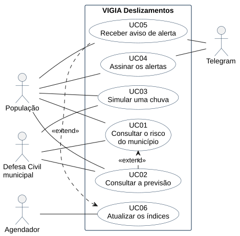

# VIGIA Deslizamentos

### Sistema Integrado de Monitoramento e Apoio à Decisão para Risco de Deslizamentos

> Projeto Integrador II — UDESC CEAVI

## Sobre o projeto

O **VIGIA Deslizamentos** é um sistema de monitoramento e apoio à decisão voltado à identificação de condições meteorológicas associadas ao risco de deslizamentos de terra nos municípios do Vale Norte, no Alto Vale do Itajaí (SC).

A proposta é integrar dados meteorológicos, geográficos e históricos para apresentar informações de forma simples e visual, auxiliando no acompanhamento das condições de risco por meio de um mapa interativo, indicadores de fácil leitura e notificações via Telegram — tanto para gestores públicos quanto para a população em geral.

O sistema é um **apoio à decisão**, não um emissor de alertas oficiais.

## Motivação

Deslizamentos de terra estão entre os desastres naturais mais recorrentes e letais no Brasil, especialmente em regiões de relevo acidentado combinadas com chuvas intensas e ocupação irregular de encostas. O caso mais emblemático de Santa Catarina ocorreu em novembro de 2008, quando chuvas prolongadas seguidas de temporais provocaram uma série de deslizamentos no Vale do Itajaí, resultando em mais de cem vítimas fatais e afetando dezenas de municípios da região. Episódios como esse reforçam a importância de sistemas de monitoramento capazes de antecipar cenários de risco e apoiar decisões rápidas por parte da Defesa Civil e da população.

O VIGIA Deslizamentos nasce dessa necessidade: transformar dados dispersos (chuva observada, previsão meteorológica, relevo e histórico de ocorrências) em informação acessível e acionável em escala local.

## Objetivo

Desenvolver um sistema capaz de integrar e analisar dados de precipitação observada e prevista, aplicando a metodologia de cálculo de risco do sistema GeoRisk (Cemaden/MCTI), para fornecer informações que auxiliem no monitoramento e na tomada de decisão diante de possíveis situações de risco de deslizamento nos municípios do Vale Norte.

**Objetivos específicos:**

- Consolidar, em uma única plataforma, dados de precipitação observada, previsão meteorológica e histórico de ocorrências dos seis municípios da área de abrangência;
- Implementar o cálculo do índice de risco conforme a metodologia documentada no Manual Técnico do GeoRisk, com as simplificações declaradas neste documento;
- Classificar automaticamente o nível de risco por município;
- Apresentar os resultados por meio de mapa interativo e painéis de indicadores;
- Notificar usuários inscritos, via Telegram, quando um município atingir nível de risco relevante;
- Estruturar o sistema de forma modular, isolando os parâmetros por município (limiar crítico, meia-vida) da lógica central de coleta, cálculo e visualização.

## Área de abrangência

O escopo está **fechado** na sub-região do **Vale Norte**, dentro do Alto Vale do Itajaí (SC), composta pelos seguintes seis municípios:

| Município | Código IBGE | Observações |
|-----------|-------------|-------------|
| Dona Emma | *a preencher* | |
| Ibirama | *a preencher* | |
| José Boiteux | *a preencher* | |
| Presidente Getúlio | *a preencher* | |
| Vitor Meirelles | *a preencher* | |
| Witmarsum | *a preencher* | |

> Os códigos IBGE devem ser preenchidos a partir da [API de Localidades do IBGE](https://servicodados.ibge.gov.br/api/docs/localidades) e são a chave de identificação de município em todo o sistema (malha geográfica, parâmetros de cálculo e persistência).

A arquitetura isola os parâmetros específicos de cada município (limites geográficos, limiar crítico, meia-vida da água no solo) da lógica central de coleta, processamento e visualização. Isso permite incorporar novos municípios por configuração, mas **a expansão para outras regiões não faz parte do escopo desta versão**.

## Metodologia de cálculo do risco

O cálculo do índice de risco segue a metodologia do **Sistema GeoRisk**, do Cemaden/MCTI, conforme documentado em:

> CAMARINHA, P. I. M. *Metodologia aplicada ao Sistema GeoRisk*. Manual Técnico v.03-2026. Nota Técnica Nº 64/2025/SEI-CEMADEN. Cemaden/MCTI.

O VIGIA **não reproduz integralmente** o GeoRisk: aplica as mesmas equações com um conjunto reduzido de fontes e parâmetros não calibrados. As diferenças estão declaradas em [Simplificações assumidas](#simplificações-assumidas-pelo-vigia).

### Limiar crítico de precipitação

O limiar crítico é o valor mínimo de chuva acumulada que, quando superado, indica possibilidade de deflagração de deslizamentos. No GeoRisk, cada município possui um único limiar de referência, calculado para acumulados de 24 horas e extrapolado para todo o território municipal.

Para municípios não monitorados pelo Cemaden ou sem áreas suscetíveis mapeadas, o GeoRisk adota um limiar hipotético padrão de **250 mm**, e recomenda usar apenas os resultados de análise regional.

No VIGIA, o limiar é um **parâmetro de configuração por município**, versionado no repositório e documentado com a respectiva fonte. Os valores dos seis municípios ainda serão definidos.

### Chuva efetiva antecedente

A chuva efetiva antecedente (`EfR`) é a parcela da chuva pretérita que ainda influencia a instabilidade das encostas, calculada sobre as **168 horas (7 dias)** anteriores ao dia-alvo, com decaimento exponencial pelo fator de **meia-vida da água no solo** (`MV`):

$$EfR = \sum_{t=0}^{168} Rh_t \cdot 0{,}5^{\frac{t}{MV}}$$

Onde `Rh` é a chuva horária entre a meia-noite do dia-alvo e as 168 horas anteriores, e `MV` é o parâmetro de decaimento por meia-vida. Na ausência de estudos específicos para o município, o GeoRisk adota **MV = 24 horas** — valor que o VIGIA usa como padrão para os seis municípios.

O período antecedente é preenchido prioritariamente com **dados observados**; onde não houver observação disponível, completa-se com dados de previsão numérica.

### Subíndice de risco

Para cada rodada de previsão numérica disponível, calcula-se um subíndice de risco:

$$SubIR_i = \frac{EfR + Rtotal_{i,\text{dia-alvo}}}{Limiar}$$

Onde `Rtotal` é o total de precipitação acumulada prevista para o dia-alvo (24 horas) pelo respectivo modelo. Um subíndice **maior que 1,0** indica que há possibilidade evidenciada de ocorrerem deslizamentos.

Quando há múltiplos pontos de cálculo dentro de um mesmo município, adota-se o **maior subíndice** encontrado, atribuindo-o ao município inteiro — conforme o procedimento de agregação por polígono do GeoRisk.

### Índice de risco

O índice final combina os `n` subíndices disponíveis por média ponderada, usando a técnica de *time-lagged ensemble* (aproveitando rodadas de até 36 horas antes do momento da análise):

$$\text{Índice de Risco} = \frac{\sum_{i=1}^{n} W_i \cdot SubIR_i}{\sum_{i=1}^{n} W_i}$$

No GeoRisk, os pesos `W` dependem de três fatores: distância temporal da rodada em relação ao momento da análise (rodadas mais recentes pesam mais), presença de assimilação de dados (rodadas 00 UTC e 12 UTC pesam mais que 06 UTC e 18 UTC) e destreza histórica de cada modelo, recalculada periodicamente por matriz de confusão contra ocorrências reais.

### Classes de risco

| Classe | Índice de risco |
|--------|-----------------|
| Extremamente baixo | < 0,40 |
| Muito baixo | 0,40 – 0,70 |
| Baixo | 0,70 – 1,00 |
| Moderado | 1,00 – 1,80 |
| Alto | 1,80 – 2,60 |
| Muito alto | 2,60 – 3,40 |
| Extremamente alto | > 3,40 |

> **Atenção:** o manual técnico apresenta sobreposição entre as classes "moderado" (1,00–1,80) e "alto" (1,60–2,60). O VIGIA adota o corte único em **1,80**, que coincide com o limiar de 1,8 das probabilidades de deslizamentos esparsos.

Na interface, a classe extremamente alto usa a cor do GeoRisk (`#713371`).

O GeoRisk considera "alerta" qualquer resultado com índice maior ou igual a 1,0, correspondente à classe moderado ou superior. O mesmo corte é adotado pelo VIGIA como gatilho de notificação.

### Probabilidades complementares

A partir do percentual de subíndices ponderados que superam determinados valores, o sistema apresenta probabilidades associadas a diferentes magnitudes de evento:

| Evento | Critério |
|--------|----------|
| Deslizamentos pontuais | percentual de subíndices > 1,0 |
| Deslizamentos esparsos | percentual de subíndices > 1,8 |
| Deslizamentos generalizados | percentual de subíndices > 2,6 |

Conforme o manual, essas probabilidades são **informação secundária** — o índice de risco é a referência principal para a tomada de decisão.

### Simplificações assumidas pelo VIGIA

| Aspecto | GeoRisk | VIGIA |
|---------|---------|-------|
| Grade de cálculo | Grade de 5 km × 5 km sobre todo o território nacional | Pontos representativos por município (centróide e pontos adicionais conforme a extensão territorial) |
| Modelos de previsão | 15 a 25 rodadas de GEFS, GFS, WRF, Eta e ECMWF, obtidas direto da fonte | Modelos e ensembles disponibilizados via API pública (a definir na integração) |
| Pesos do ensemble | Recalibrados periodicamente por matriz de confusão contra ocorrências reais | Pesos fixos por recência e horário de assimilação, **sem calibração** |
| Limiar crítico | Calibrado por município pelo Cemaden | Parâmetro de configuração, com fonte documentada |
| Meia-vida (MV) | Valor por município quando há estudo disponível | 24 horas (padrão) para todos os municípios |
| Validação | Matriz de confusão contra o REINDESC (2017–presente) | Sem validação estatística — ver limitações |

### Limitações conhecidas

- **Os pesos do ensemble não são calibrados.** Sem acesso a uma base de ocorrências com cobertura suficiente, não é possível reproduzir o processo de calibração descrito no manual. Os resultados do VIGIA não têm as métricas de POD e FAR do GeoRisk.
- **O limiar crítico é o parâmetro mais sensível da fórmula.** Um limiar incorreto desloca todo o índice. Enquanto os valores não forem obtidos de fonte oficial, os resultados devem ser lidos como demonstração metodológica.
- **A metodologia é de escala regional.** O GeoRisk explicitamente não se propõe a prever a localização exata de deslizamentos em nível de encosta.
- **A resolução da previsão meteorológica é maior que os municípios.** Os modelos globais operam em grades de aproximadamente 25 km — maior que a área de vários dos municípios atendidos. A previsão de chuva praticamente não varia dentro de um mesmo município, o que impede diferenciação intramunicipal a partir de dados de chuva.
- **O sistema tem melhor desempenho para deslizamentos do tipo translacional raso**, conforme o manual.
- **Horários em UTC.** O conceito de "dia-alvo" da metodologia é ancorado em UTC; a conversão para o horário de Brasília (UTC-3) precisa ser tratada explicitamente no cálculo e na exibição.

## Funcionamento

O sistema segue o fluxo:

**Coleta → Tratamento → Cálculo → Classificação → Visualização e notificação**

1. **Coleta:** ingestão de precipitação observada (168 h anteriores) e previsão de precipitação para os dias-alvo, por ponto de cálculo de cada município;
2. **Tratamento:** padronização das séries horárias, preenchimento de lacunas com previsão numérica e associação dos pontos aos municípios;
3. **Cálculo:** chuva efetiva antecedente, subíndices por rodada e índice de risco ponderado;
4. **Classificação:** enquadramento do índice nas classes de risco e cálculo das probabilidades complementares;
5. **Publicação e notificação:** gravação no banco, publicação do `indices.json` consumido pelo site e envio de mensagem via Telegram aos inscritos quando o gatilho é atingido.

O pipeline é executado de forma agendada, **a cada 6 horas**, após a disponibilização das rodadas 00, 06, 12 e 18 UTC dos modelos de previsão.

## Dados e fontes

### Fontes integradas no projeto

| Fonte | Tipo de dado | Papel no sistema |
|-------|--------------|------------------|
| **[Open-Meteo](https://open-meteo.com/)** | Previsão de precipitação e histórico horário | Fonte principal de previsão (`Rtotal`) e de chuva observada para compor a chuva efetiva antecedente. API REST gratuita, sem chave para uso não comercial. |
| **[INMET](https://portal.inmet.gov.br/)** — API de estações | Precipitação horária e diária por estação automática | Fonte de observação para comparação e validação da chuva antecedente na região. |
| **[IBGE — Localidades e Malhas](https://servicodados.ibge.gov.br/api/docs/localidades)** | Código, limites municipais e hierarquia geográfica | Identificação dos municípios e polígonos em GeoJSON para o mapa. Consumido uma vez e versionado no repositório. |

### Fontes usadas como dado estático

| Fonte | Tipo de dado | Papel no sistema |
|-------|--------------|------------------|
| **[CPRM / GeoSGB](https://geosgb.cprm.gov.br/)** | Cartas de suscetibilidade a movimentos de massa | Camada informativa de suscetibilidade do terreno. Disponibilizado via WMS/WFS e shapefile — será baixado uma vez, convertido para GeoJSON e versionado, **sem integração automatizada**. |
| **Defesa Civil (municipal/estadual) e [S2iD](https://s2id.mi.gov.br/)** | Histórico de ocorrências e decretos de emergência | Levantamento manual, para compor a base histórica de ocorrências dos seis municípios. |

### Fontes fora do escopo do projeto

**CEMADEN (pluviômetros via PED)** e **ANA (HidroWebService)** não serão integradas: a primeira não expõe API REST pública documentada e pode exigir parceria formal; a segunda exige cadastro e trata de variável hidrológica complementar, fora do núcleo da metodologia adotada.

## Funcionalidades previstas

### Interface web

- Mapa interativo com os seis municípios, coloridos pela classe de risco vigente;
- Painel de indicadores gerais (municípios por classe, chuva acumulada, última atualização);
- Detalhamento por município: índice de risco, classe, chuva efetiva antecedente, previsão por dia-alvo, probabilidades complementares e limiar utilizado;
- Camada de suscetibilidade do terreno (CPRM);
- Consulta às fontes e aos dados brutos utilizados em cada análise, com data/hora de coleta;
- Histórico de ocorrências registradas por município.

### Notificação via Telegram

- Inscrição pelo bot (`/start`), com seleção de um ou mais municípios de interesse;
- Envio de mensagem quando um município inscrito atinge índice de risco ≥ 1,0 (classe moderado ou superior);
- Cancelamento da inscrição (`/parar`) e consulta ao status atual (`/status`);
- Controle para não repetir notificação enquanto o município permanecer na mesma classe.

### Camada submunicipal (condicional)

Tentativa de apresentar diferenciação **dentro** dos municípios, condicionada à disponibilidade de dados.

Como registrado nas limitações, a previsão de chuva não varia na escala intramunicipal destes municípios — portanto, qualquer diferenciação interna deve vir de **características estáticas do terreno** (declividade e suscetibilidade do CPRM), apresentada como *camada de suscetibilidade*, e **não** como um índice de risco por bairro. O índice de risco permanece municipal.

Vale notar que o IBGE não publica malha de bairros para municípios deste porte; o que existe é setor censitário e divisão por distrito/localidade. A viabilidade desta camada deve ser avaliada na etapa de levantamento de dados, e ela **não é requisito obrigatório do projeto**.

## Arquitetura

O projeto utiliza a **RADIAN** como arquitetura de referência para a organização do sistema de apoio à decisão.

> *RADIAN: uma proposta de arquitetura de referência de sistemas de suporte à decisão para gerenciamento de desastres naturais.* Universidade Federal de Santa Catarina. Disponível no [Repositório Institucional da UFSC](https://repositorio.ufsc.br/handle/123456789/271363). *(autoria e ano a completar na citação formal)*

A arquitetura orienta a separação dos componentes responsáveis pela aquisição, processamento, integração, análise e apresentação dos dados. Os parâmetros específicos de cada município (limiar, meia-vida, pontos de cálculo, polígono) ficam isolados em configuração, de modo que a inclusão de um município não exija alteração dos módulos centrais.

### RADIAN aplicada ao VIGIA

A RADIAN divide um sistema de apoio à decisão para desastres naturais em duas partes: o **DSS** (5 blocos, 13 módulos e 42 macrofuncionalidades) e o **Ecossistema** (sistemas e entidades externas). O VIGIA é derivado dela em três passos: da arquitetura **genérica** (RADIAN completa), para a **parcial** (desastre geológico deflagrado por chuva, nas fases de prevenção, preparação e alerta à população) e, por fim, para a **específica** (VIGIA, seis municípios do Vale Norte).

| Bloco RADIAN | No VIGIA |
|---|---|
| Sistema de Interface do Usuário | 7 telas, idiomas PT/ES, acessibilidade e contatos de emergência |
| Sistemas Cognitivos — Análise e Tomada de Decisão | Mapa de risco, painel do município, previsões D0–D3, simulação, dados da análise e cartilha (FAQ) |
| Sistemas Cognitivos — Supervisão da Execução de Decisões | Geração e envio de alertas pelo Telegram |
| Sistemas de Gerenciamento de Dados e Conhecimento | Banco SQLite (índices calculados e inscritos do bot), malhas IBGE e estações |
| Sistemas de Suporte | Privacidade (LGPD): o site não coleta dados pessoais; o bot guarda só o chat e os municípios escolhidos |
| Sistemas de Infraestrutura Computacional | Coleta (Open-Meteo, INMET), cálculo e integração com IBGE, Defesa Civil SC (iframe) e Telegram |
| Ecossistema | Open-Meteo, INMET, Epagri/Ciram, IBGE, Cemaden (referência metodológica), Defesa Civil SC, Telegram, OpenStreetMap, Google Maps (links "como chegar") |

Não se aplicam ao projeto o módulo Planejamento da Execução (abrigos, doações, resgates) e as macrofuncionalidades de decisão multicritério, plataforma colaborativa, governança/auditoria e atuação sobre sistemas físicos.

### Componentes principais

| Componente | Responsabilidade |
|------------|------------------|
| Coletor | Consumo das APIs de precipitação observada e prevista |
| Processador | Cálculo da chuva efetiva antecedente, subíndices e índice de risco |
| Classificador | Enquadramento nas classes e cálculo das probabilidades complementares |
| Persistência | Banco SQLite com os índices calculados, os inscritos do bot e o controle de notificações |
| Exportador | Gera o `indices.json` com os resultados e o publica junto do frontend |
| Notificador | Bot do Telegram: inscrição, disparo e controle de repetição |
| Interface | Mapa, painéis e consulta aos dados |

### Fluxo de dados

O backend roda o pipeline de forma agendada, grava os resultados no SQLite e publica um arquivo `indices.json` junto do frontend no GitHub Pages. O site lê esse arquivo em vez de consultar o backend a cada visita; assim, se o backend ficar fora do ar, o site continua exibindo o último índice publicado, com data e hora. A publicação é feita por commit automático do arquivo no repositório, pela API do GitHub, com um token restrito a este repositório.

### Banco de dados

O VIGIA usa **SQLite** como banco padrão: um único arquivo, sem servidor, suficiente para o volume do projeto (seis municípios e algumas rodadas de cálculo por dia). A troca para PostgreSQL só é necessária se a hospedagem do backend não tiver disco persistente ou se houver mais de uma instância.

O banco guarda apenas o que não pode ser obtido de novo nas APIs:

| Tabela | Conteúdo | Uso |
|---|---|---|
| `indices` | Município (código IBGE), dia-alvo, data/hora do cálculo, índice de risco, classe, probabilidades complementares e os valores usados no cálculo (chuva efetiva antecedente, chuva prevista, limiar) | Mapa, painel do município, evolução do índice, tendência e consulta aos dados de cada análise |
| `inscritos` | Identificador do chat do Telegram, municípios escolhidos e data da inscrição | Envio dos avisos; removidos com `/parar` |
| `notificacoes` | Município e última classe notificada | Evitar repetir o aviso enquanto o município permanecer na mesma classe |

Os municípios (código IBGE, nome, limiar, meia-vida e pontos de cálculo) vêm do arquivo de configuração `config/municipios.json`, não de uma tabela editável.

As séries horárias de chuva não são armazenadas: a cada execução, as 168 horas anteriores são consultadas novamente no Open-Meteo. Nenhum outro dado pessoal é guardado além do identificador do chat; os inscritos são apagados na hora com `/parar` e automaticamente quando o usuário bloqueia o bot, e esses dados não são compartilhados com terceiros.

## Especificação do sistema

### Público e casos de uso

O VIGIA atende a **população** dos seis municípios e as **coordenadorias municipais de Defesa Civil**, sem login.



| Caso de uso | Ator | Fluxo principal | Exceção |
|---|---|---|---|
| **UC01** Consultar o risco do município | População, Defesa Civil | Abre o site, vê o mapa e o total de municípios em alerta, seleciona o município (clique ou busca) e lê índice, classe e situação de alerta no painel | Dados desatualizados: exibe o último índice com data e hora |
| **UC02** Consultar a previsão | População, Defesa Civil | Estende o UC01: no mapa, escolhe +1, +2 ou +3 dias, e mapa e painel mostram os valores estimados | — |
| **UC03** Simular uma chuva | População, Defesa Civil | Abre a simulação (menu ou painel), informa município, período e chuva e compara a situação atual com a simulada | Valor fora da faixa: o campo limita a chuva entre 0 e 400 mm |
| **UC04** Assinar os alertas | População | Toca em "Alertas no Telegram", abre o bot, envia `/start` e escolhe os municípios; `/parar` cancela | Telegram não instalado: o link abre a página do bot no navegador |
| **UC05** Receber aviso de alerta | Inscrito, via Telegram | Após uma atualização, o município chega a índice ≥ 1,00 ou sobe de classe, e o bot envia o aviso com índice, classe e link do site | Mesma classe da última notificação: o aviso não é repetido |
| **UC06** Atualizar os índices | Agendador (sistema) | Coleta chuva e previsão, calcula índice e classe, grava no banco, publica o JSON; se algum município mudar de classe com índice ≥ 1,00, é estendido pelo UC05 | Falha na coleta: mantém o último JSON publicado e registra o erro |

### Telas

| Tela | Rota | Conteúdo principal |
|---|---|---|
| Monitoramento | `/` | Mapa colorido pela classe de risco, resumo "N de 6 em alerta", previsões D0–D3, busca, legenda e painel do município |
| Simulação | `/simulacao` | Município, período e chuva informada; o mapa recolore e compara a situação atual com a simulada |
| Dados da análise | `/dados` | Indicadores, evolução do índice em 7 dias, chuva acumulada e tabela por município |
| Monitoramento SC | `/monitoramento-sc` | Mapa oficial da Defesa Civil de SC incorporado, com link para o site |
| Estações | `/estacoes` | Localização das estações de monitoramento |
| Cartilha | `/cartilha` | Sinais de perigo, o que fazer antes/durante/depois, mochila de emergência, "não faça" |
| Contatos | `/contatos` | Números de emergência e Defesa Civil de cada município |

Em todas as telas: menu, seletor PT/ES, acessibilidade e "Alertas no Telegram".

### Requisitos funcionais

**Monitoramento**
- **RF01** — Exibir o mapa dos seis municípios coloridos pela classe de risco, com nome e índice, e o total de municípios em alerta.
- **RF02** — Selecionar um município (clique, toque, teclado ou busca por nome) e mostrar no painel: índice, classe, situação de alerta, chuva efetiva antecedente e limiar.
- **RF03** — Mostrar a previsão para os próximos 3 dias.
- **RF04** — A partir do painel, compartilhar a situação do município, abrir a simulação e assinar os alertas do município no Telegram.

**Simulação e análise**
- **RF05** — Simular o índice a partir de município, período (24/48/72 h) e chuva em mm, para um município ou para toda a região, comparando a situação atual com a simulada.
- **RF06** — Exibir a evolução do índice, a chuva acumulada (24–96 h) comparada ao limiar e uma tabela com a tendência de cada município.
- **RF07** — Exibir probabilidades complementares, fontes e dados brutos com data da coleta, histórico de ocorrências e, se viável, a camada de suscetibilidade do CPRM (ainda sem tela no protótipo).

**Informação à população**
- **RF08** — Incorporar o mapa oficial da Defesa Civil de SC; se o site bloquear, mostrar só o link.
- **RF09** — Mostrar a localização das estações de monitoramento, com tipo, município e fonte.
- **RF10** — Apresentar a cartilha de autoproteção e os contatos de emergência e das Defesas Civis municipais.

**Alertas e preferências**
- **RF11** — Levar o usuário ao bot do Telegram, onde ele escolhe os municípios (`/start`), consulta a situação (`/status`) e cancela (`/parar`).
- **RF12** — Enviar aviso aos inscritos quando um município atingir índice ≥ 1,00.
- **RF13** — Oferecer português e espanhol, tema automático/claro/escuro/alto contraste e paleta de cores para daltonismo, lembrando a escolha do usuário.

### Requisitos não funcionais

- **RNF01 — Acessibilidade:** WCAG 2.1 AA, com uso completo por teclado e leitor de tela.
- **RNF02 — Responsividade:** funcionar de 320 px até desktop sem rolagem lateral.
- **RNF03 — Desempenho:** página principal carregada em até 2,5 s em conexão 4G; simulação e troca de dia em até 500 ms.
- **RNF04 — Disponibilidade:** se a atualização falhar, exibir o último índice válido com data e hora.
- **RNF05 — Privacidade (LGPD):** o site não coleta dados pessoais; o bot guarda só o identificador do chat e os municípios escolhidos, apagados com `/parar` ou quando o usuário bloqueia o bot.
- **RNF06 — Segurança:** acesso somente por HTTPS e nenhum token ou chave exposto no frontend.
- **RNF07 — Manutenibilidade:** parâmetros de cada município em configuração, para incluir municípios sem alterar o código.

### Regras de negócio

- **RN01** — Classes de risco conforme a tabela da [metodologia](#classes-de-risco), com corte único em 1,80 entre moderado e alto.
- **RN02** — O município está **em alerta** quando o índice é ≥ 1,00.
- **RN03** — O risco nunca é indicado só por cor: sempre com ícone e nome da classe.
- **RN04** — Todo texto de risco é condicional ("poderá entrar em alerta"), e toda tela com índice informa que o VIGIA não emite alerta oficial.
- **RN05** — Números usam vírgula decimal.
- **RN06** — Previsões (D1–D3) aparecem sempre marcadas como valores estimados.
- **RN07** — A simulação usa a mesma equação do subíndice, trocando a chuva prevista pela chuva informada: (EfR + chuva) ÷ limiar. Ela não altera dados reais e não dispara alertas (o protótipo ainda usa uma fórmula ilustrativa).
- **RN08** — O aviso do bot não se repete enquanto o município permanecer na mesma classe.
- **RN09** — Só vão ao ar contatos verificados com a prefeitura.
- **RN10** — O mapa oficial de SC só é incorporado com autorização, mantendo o crédito da fonte.
- **RN11** — Dia-alvo e horário da última atualização ficam sempre visíveis.

## Tecnologias

- **Frontend:** Astro + React
- **Mapas:** Leaflet + OpenStreetMap
- **Dados geográficos:** GeoJSON (malhas municipais do IBGE)
- **Backend:** Python
- **API:** FastAPI (opcional; o site lê o JSON exportado)
- **Cálculo:** pandas / NumPy
- **Agendamento:** APScheduler (ou cron no host), a cada 6 horas
- **Bot:** python-telegram-bot, em long polling (dispensa domínio e certificado HTTPS próprios)
- **Banco de dados:** SQLite (PostgreSQL se a hospedagem exigir)
- **Hospedagem do frontend:** GitHub Pages
- **Hospedagem do backend:** *a definir*
- **Arquitetura de referência:** RADIAN
- **Idiomas:** Português e Espanhol
- **Acessibilidade:** verificação com axe-core antes de cada publicação

> **Sobre a escolha do backend:** o GitHub Pages serve apenas conteúdo estático, e o bot com inscrição por usuário exige um processo em execução contínua e um banco de inscritos. Isso torna necessário um backend próprio, hospedado fora do GitHub Pages. Python foi escolhido por concentrar as bibliotecas adequadas ao tipo de processamento da metodologia (séries horárias, decaimento exponencial, agregação de ensemble) e por ter a biblioteca de bot mais madura para o caso de uso.

## Estrutura do repositório

```
vigia-deslizamentos/
├── backend/
│   ├── app/
│   │   ├── coleta/          # Clientes das APIs de precipitação
│   │   ├── calculo/         # Chuva efetiva, subíndices, índice de risco
│   │   ├── classificacao/   # Classes de risco e probabilidades
│   │   ├── bot/             # Bot do Telegram
│   │   ├── exportacao/      # Geração do indices.json consumido pelo frontend
│   │   └── modelos/         # Modelos de dados e persistência
│   ├── config/
│   │   └── municipios.json  # Limiar, meia-vida e pontos de cálculo por município
│   └── tests/
├── frontend/
│   ├── src/
│   │   ├── components/      # Componentes de interface (React)
│   │   ├── layouts/         # Layouts Astro
│   │   ├── pages/           # Páginas do site
│   │   └── data/            # GeoJSON dos municípios e camadas estáticas
│   └── public/
└── docs/                    # Metodologia, fontes de dados e decisões de projeto
```

> Estrutura sujeita a ajustes conforme o projeto evolui.

## Roteiro de desenvolvimento

1. Definição dos requisitos funcionais e das regras de negócio;
2. Levantamento dos parâmetros por município (código IBGE, limiar crítico, pontos de cálculo);
3. Integração das fontes de precipitação observada e prevista;
4. Implementação do cálculo do índice de risco conforme a metodologia GeoRisk;
5. Persistência no banco e exportação dos resultados em JSON;
6. Implementação do mapa e dos painéis de visualização;
7. Implementação do bot do Telegram com inscrição e disparo;
8. Testes e verificação dos cálculos contra os resultados públicos do GeoRisk para os mesmos municípios e datas;
9. Publicação da versão inicial.

## Como contribuir

Este é um projeto acadêmico desenvolvido no âmbito do Projeto Integrador II. Sugestões, correções e contribuições da comunidade são bem-vindas por meio de *issues* e *pull requests* neste repositório.

## Licença

Projeto de caráter acadêmico. Uso, licenciamento e reaproveitamento dos dados serão detalhados conforme o projeto avança.

## Equipe

Projeto desenvolvido por Guilherme Rode e Kaique de Oliveira.
